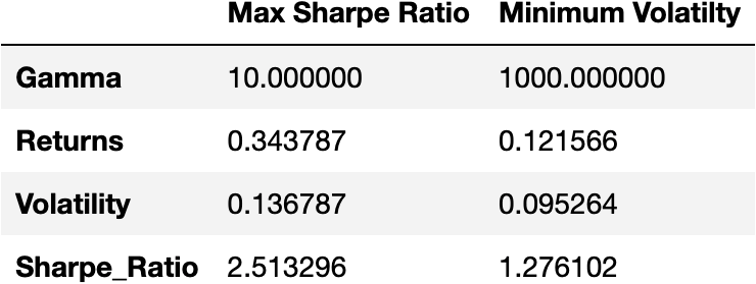
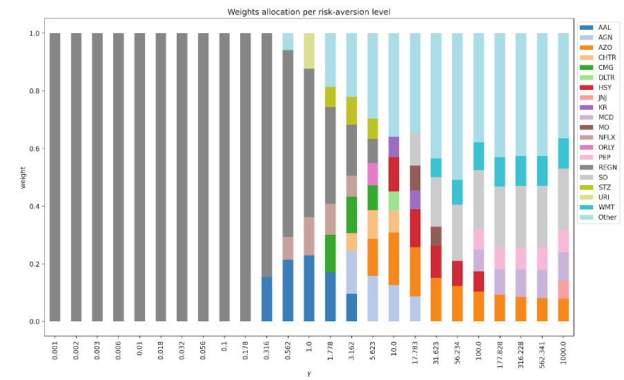
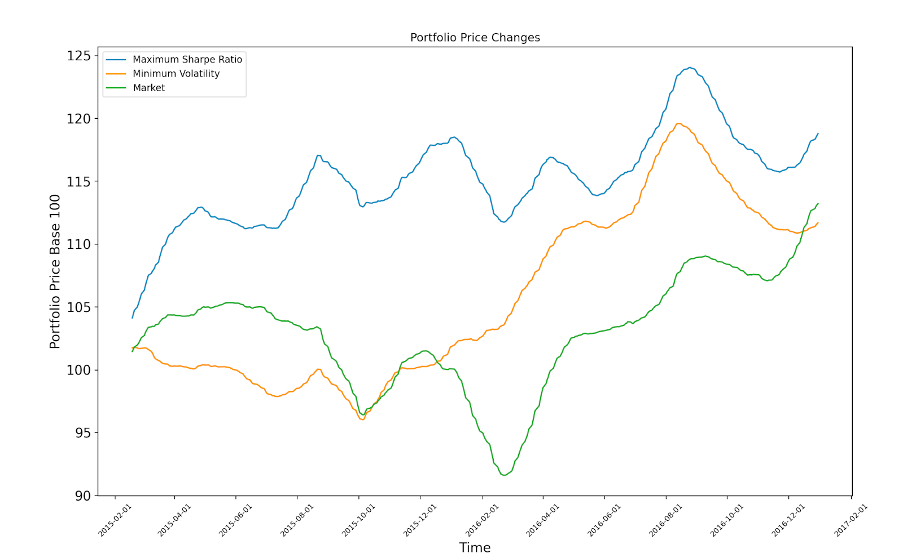

# Portfolio-Construction (Jan 2022)
Using convex optimisation to construct a portfolio of risky assets

The goal for this project was to test my coding skills in a topic relevant to my interests. Portfolio construction is incredibly important in finance and it is something I am learning in my university studies, therefore I wanted to see how it could be automated using coding and if it would be successful. To complete this project I used my coding foundational knowledge, in Python, as well as information from various sources on the internet for more specific coding challenges. The project challenged my ability to do research on my own for very specific problems and strengthened my problem solving skills.

The portfolio is constructed by setting an objective function to maximise risk adjusted returns and entering it into a solver to create an optimised portfolio for different risk levels. Two portfolios were examined against the "market" (mean of all available S&P500 stocks) performance, the optimised portfolio with minimum volatility and the optimised portfolio with the maximum sharpe ratio. Further results and details of the portfolios can be seen in the images folder.

Portfolios chosen.

Calculated portfolio weightings by risk level.

The returns of the two portfolios compared to an evenly distributed portfolio.

To upload to GitHub the data has been split into three where it was originally one csv.

# References
More in depth doc: https://docs.google.com/document/d/1QmDnNypY3BuFXPwbqAmFV3q9Je_IokH5/edit?usp=sharing&ouid=111634927463417999921&rtpof=true&sd=true

Optimisation code: Lewinson, E., 2020. Python for Finance Cookbook. Place of publication: Packt Publishing Ltd.

Data: https://www.kaggle.com/datasets/dgawlik/nyse
